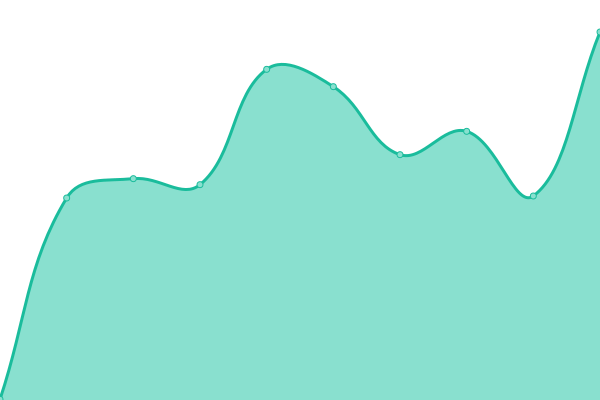

# [📈 Live Status](https://JFronny.github.io/uptime): <!--live status--> **🟧 Partial outage**

This repository contains the open-source uptime monitor and status page for [J. Fronny](https://jfronny.gitlab.io/), powered by [Upptime](https://github.com/upptime/upptime).

With [Upptime](https://upptime.js.org), you can get your own unlimited and free uptime monitor and status page, powered entirely by a GitHub repository. We use [Issues](https://github.com/JFronny/uptime/issues) as incident reports, [Actions](https://github.com/JFronny/uptime/actions) as uptime monitors, and [Pages](https://JFronny.github.io/uptime) for the status page.

<!--start: status pages-->
<!-- This summary is generated by Upptime (https://github.com/upptime/upptime) -->
<!-- Do not edit this manually, your changes will be overwritten -->
<!-- prettier-ignore -->
| URL | Status | History | Response Time | Uptime |
| --- | ------ | ------- | ------------- | ------ |
|  [JfGit](https://git.frohnmeyer-wds.de/) | 🟥 Down | [jf-git.yml](https://github.com/JFronny/uptime/commits/HEAD/history/jf-git.yml) | 

 1245ms
     
 | 

<a href="https://JFronny.github.io/uptime/history/jf-git">99.09%</a>
    

|  [Gitea Helpdesk Issues](https://git.frohnmeyer-wds.de/Johannes/Gitea-Helpdesk/issues) | 🟥 Down | [gitea-helpdesk-issues.yml](https://github.com/JFronny/uptime/commits/HEAD/history/gitea-helpdesk-issues.yml) | 

 388ms
     
 | 

<a href="https://JFronny.github.io/uptime/history/gitea-helpdesk-issues">99.10%</a>
    

|  [Gitea Helpdesk Issue](https://git.frohnmeyer-wds.de/Johannes/Gitea-Helpdesk/issues/1) | 🟥 Down | [gitea-helpdesk-issue.yml](https://github.com/JFronny/uptime/commits/HEAD/history/gitea-helpdesk-issue.yml) | 

 405ms
     
 | 

<a href="https://JFronny.github.io/uptime/history/gitea-helpdesk-issue">99.11%</a>
    

|  [Gitea Modified PRs](https://git.frohnmeyer-wds.de/JfMods/VersionChanger/pulls) | 🟥 Down | [gitea-modified-p-rs.yml](https://github.com/JFronny/uptime/commits/HEAD/history/gitea-modified-p-rs.yml) | 

 269ms
     
 | 

<a href="https://JFronny.github.io/uptime/history/gitea-modified-p-rs">99.12%</a>
    

|  [YouTrack](https://youtrack.frohnmeyer-wds.de/form/cc0e428b-e887-4487-a90a-9e12b28ff4a4) | 🟥 Down | [you-track.yml](https://github.com/JFronny/uptime/commits/HEAD/history/you-track.yml) | 

 590ms
     
 | 

<a href="https://JFronny.github.io/uptime/history/you-track">99.13%</a>
    

|  [Gitea Helpdesk](https://helpdesk.frohnmeyer-wds.de/) | 🟥 Down | [gitea-helpdesk.yml](https://github.com/JFronny/uptime/commits/HEAD/history/gitea-helpdesk.yml) | 

 597ms
     
 | 

<a href="https://JFronny.github.io/uptime/history/gitea-helpdesk">99.14%</a>
    

|  [Woodpecker](https://ci.frohnmeyer-wds.de/repos/28) | 🟥 Down | [woodpecker.yml](https://github.com/JFronny/uptime/commits/HEAD/history/woodpecker.yml) | 

 606ms
     
 | 

<a href="https://JFronny.github.io/uptime/history/woodpecker">99.15%</a>
    

|  [Pages](https://pages.frohnmeyer-wds.de/JfMods/Respackopts/) | 🟥 Down | [pages.yml](https://github.com/JFronny/uptime/commits/HEAD/history/pages.yml) | 

 662ms
     
 | 

<a href="https://JFronny.github.io/uptime/history/pages">99.16%</a>
    

|  [Frohnmeyer-Maven](https://maven.frohnmeyer-wds.de/artifacts/io/gitlab/jfronny/commons-bom/maven-metadata.xml) | 🟥 Down | [frohnmeyer-maven.yml](https://github.com/JFronny/uptime/commits/HEAD/history/frohnmeyer-maven.yml) | 

 493ms
     
 | 

<a href="https://JFronny.github.io/uptime/history/frohnmeyer-maven">99.17%</a>
    

|  [Matrix](https://matrix.frohnmeyer-wds.de/_matrix/client/versions) | 🟥 Down | [matrix.yml](https://github.com/JFronny/uptime/commits/HEAD/history/matrix.yml) | 

 489ms
     
 | 

<a href="https://JFronny.github.io/uptime/history/matrix">99.18%</a>
    

|  [Johannes](https://johannes.frohnmeyer-wds.de/schule/sport/praesentation/) | 🟥 Down | [johannes.yml](https://github.com/JFronny/uptime/commits/HEAD/history/johannes.yml) | 

 627ms
     
 | 

<a href="https://JFronny.github.io/uptime/history/johannes">99.19%</a>
    

|  [Lotus](https://lotus.frohnmeyer-wds.de/feed.rss) | 🟥 Down | [lotus.yml](https://github.com/JFronny/uptime/commits/HEAD/history/lotus.yml) | 

 1370ms
     
 | 

<a href="https://JFronny.github.io/uptime/history/lotus">99.20%</a>
    

|  [Nextcloud](https://nextcloud.frohnmeyer-wds.de/s/5LHM53735gsamFE) | 🟥 Down | [nextcloud.yml](https://github.com/JFronny/uptime/commits/HEAD/history/nextcloud.yml) | 

 667ms
     
 | 

<a href="https://JFronny.github.io/uptime/history/nextcloud">99.21%</a>
    

|  [FreshRSS](https://rss.frohnmeyer-wds.de/i/?a=about) | 🟥 Down | [fresh-rss.yml](https://github.com/JFronny/uptime/commits/HEAD/history/fresh-rss.yml) | 

 512ms
     
 | 

<a href="https://JFronny.github.io/uptime/history/fresh-rss">99.22%</a>
    

|  [S3](https://s3.frohnmeyer-wds.de/pages/JfMods/Respackopts/index.html) | 🟥 Down | [s3.yml](https://github.com/JFronny/uptime/commits/HEAD/history/s3.yml) | 

 589ms
     
 | 

<a href="https://JFronny.github.io/uptime/history/s3">99.23%</a>
    

|  [Mail (SMTP)](frohnmeyer-wds.de) | 🟥 Down | [mail-smtp.yml](https://github.com/JFronny/uptime/commits/HEAD/history/mail-smtp.yml) | 

 119ms
     
 | 

<a href="https://JFronny.github.io/uptime/history/mail-smtp">99.25%</a>
    

|  [Mail (SMTPS)](frohnmeyer-wds.de) | 🟩 Up | [mail-smtps.yml](https://github.com/JFronny/uptime/commits/HEAD/history/mail-smtps.yml) | 

 392ms
     
 | 

<a href="https://JFronny.github.io/uptime/history/mail-smtps">100.00%</a>
    

|  [Mail (IMAPS)](frohnmeyer-wds.de) | 🟩 Up | [mail-imaps.yml](https://github.com/JFronny/uptime/commits/HEAD/history/mail-imaps.yml) | 

 267ms
     
 | 

<a href="https://JFronny.github.io/uptime/history/mail-imaps">100.00%</a>
    

<!--end: status pages-->

[**Visit our status website →**](https://JFronny.github.io/uptime)

## 📄 License

- Powered by: [Upptime](https://github.com/upptime/upptime)
- Code: [MIT](./LICENSE) © [Anand Chowdhary](https://anandchowdhary.com), supported by [Pabio](https://pabio.com)
- Data in the `./history` directory: [Open Database License](https://opendatacommons.org/licenses/odbl/1-0/)
