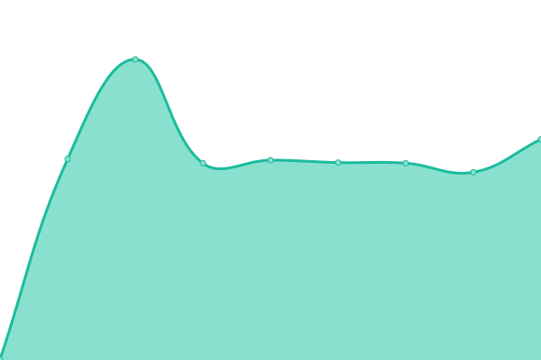
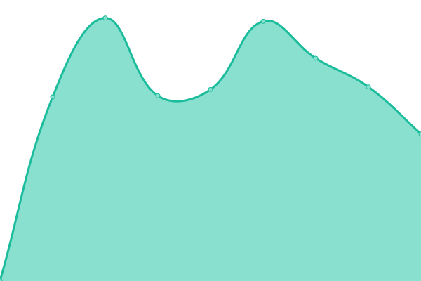

# [📈 Live Status](https://JFronny.github.io/uptime): <!--live status--> **🟩 All systems operational**

This repository contains the open-source uptime monitor and status page for [J. Fronny](https://jfronny.gitlab.io/), powered by [Upptime](https://github.com/upptime/upptime).

With [Upptime](https://upptime.js.org), you can get your own unlimited and free uptime monitor and status page, powered entirely by a GitHub repository. We use [Issues](https://github.com/JFronny/uptime/issues) as incident reports, [Actions](https://github.com/JFronny/uptime/actions) as uptime monitors, and [Pages](https://JFronny.github.io/uptime) for the status page.

<!--start: status pages-->
<!-- This summary is generated by Upptime (https://github.com/upptime/upptime) -->
<!-- Do not edit this manually, your changes will be overwritten -->
<!-- prettier-ignore -->
| URL | Status | History | Response Time | Uptime |
| --- | ------ | ------- | ------------- | ------ |
|  [JfGit](https://git.frohnmeyer-wds.de/) | 🟩 Up | [jf-git.yml](https://github.com/JFronny/uptime/commits/HEAD/history/jf-git.yml) | 

 1158ms
     
 | 

<a href="https://JFronny.github.io/uptime/history/jf-git">100.00%</a>
    

|  [Gitea Helpdesk Issues](https://git.frohnmeyer-wds.de/Johannes/Gitea-Helpdesk/issues) | 🟩 Up | [gitea-helpdesk-issues.yml](https://github.com/JFronny/uptime/commits/HEAD/history/gitea-helpdesk-issues.yml) | 

 1082ms
     
 | 

<a href="https://JFronny.github.io/uptime/history/gitea-helpdesk-issues">100.00%</a>
    

|  [Gitea Helpdesk Issue](https://git.frohnmeyer-wds.de/Johannes/Gitea-Helpdesk/issues/1) | 🟩 Up | [gitea-helpdesk-issue.yml](https://github.com/JFronny/uptime/commits/HEAD/history/gitea-helpdesk-issue.yml) | 

 1116ms
     
 | 

<a href="https://JFronny.github.io/uptime/history/gitea-helpdesk-issue">100.00%</a>
    

|  [Gitea Modified PRs](https://git.frohnmeyer-wds.de/JfMods/VersionChanger/pulls) | 🟩 Up | [gitea-modified-p-rs.yml](https://github.com/JFronny/uptime/commits/HEAD/history/gitea-modified-p-rs.yml) | 

 989ms
     
 | 

<a href="https://JFronny.github.io/uptime/history/gitea-modified-p-rs">100.00%</a>
    

|  [Gitea Helpdesk](https://helpdesk.frohnmeyer-wds.de/) | 🟩 Up | [gitea-helpdesk.yml](https://github.com/JFronny/uptime/commits/HEAD/history/gitea-helpdesk.yml) | 

 565ms
     
 | 

<a href="https://JFronny.github.io/uptime/history/gitea-helpdesk">100.00%</a>
    

|  [Woodpecker](https://ci.frohnmeyer-wds.de/repos/28) | 🟩 Up | [woodpecker.yml](https://github.com/JFronny/uptime/commits/HEAD/history/woodpecker.yml) | 

 495ms
     
 | 

<a href="https://JFronny.github.io/uptime/history/woodpecker">100.00%</a>
    

|  [Pages](https://pages.frohnmeyer-wds.de/JfMods/Respackopts/) | 🟩 Up | [pages.yml](https://github.com/JFronny/uptime/commits/HEAD/history/pages.yml) | 

 1948ms
     
 | 

<a href="https://JFronny.github.io/uptime/history/pages">100.00%</a>
    

|  [Frohnmeyer-Maven](https://maven.frohnmeyer-wds.de/artifacts/io/gitlab/jfronny/commons-bom/maven-metadata.xml) | 🟩 Up | [frohnmeyer-maven.yml](https://github.com/JFronny/uptime/commits/HEAD/history/frohnmeyer-maven.yml) | 

 505ms
     
 | 

<a href="https://JFronny.github.io/uptime/history/frohnmeyer-maven">100.00%</a>
    

|  [Matrix](https://matrix.frohnmeyer-wds.de/_matrix/client/versions) | 🟩 Up | [matrix.yml](https://github.com/JFronny/uptime/commits/HEAD/history/matrix.yml) | 

 505ms
     
 | 

<a href="https://JFronny.github.io/uptime/history/matrix">100.00%</a>
    

|  [Johannes](https://johannes.frohnmeyer-wds.de/schule/sport/praesentation/) | 🟩 Up | [johannes.yml](https://github.com/JFronny/uptime/commits/HEAD/history/johannes.yml) | 

 597ms
     
 | 

<a href="https://JFronny.github.io/uptime/history/johannes">100.00%</a>
    

|  [Lotus](https://lotus.frohnmeyer-wds.de/feed.rss) | 🟩 Up | [lotus.yml](https://github.com/JFronny/uptime/commits/HEAD/history/lotus.yml) | 

 999ms
     
 | 

<a href="https://JFronny.github.io/uptime/history/lotus">49.92%</a>
    

|  [Nextcloud](https://nextcloud.frohnmeyer-wds.de/s/5LHM53735gsamFE) | 🟩 Up | [nextcloud.yml](https://github.com/JFronny/uptime/commits/HEAD/history/nextcloud.yml) | 

 693ms
     
 | 

<a href="https://JFronny.github.io/uptime/history/nextcloud">100.00%</a>
    

|  [FreshRSS](https://rss.frohnmeyer-wds.de/i/?a=about) | 🟩 Up | [fresh-rss.yml](https://github.com/JFronny/uptime/commits/HEAD/history/fresh-rss.yml) | 

 510ms
     
 | 

<a href="https://JFronny.github.io/uptime/history/fresh-rss">100.00%</a>
    

|  [Mail (SMTP)](frohnmeyer-wds.de) | 🟩 Up | [mail-smtp.yml](https://github.com/JFronny/uptime/commits/HEAD/history/mail-smtp.yml) | 

 122ms
     
 | 

<a href="https://JFronny.github.io/uptime/history/mail-smtp">100.00%</a>
    

|  [Mail (SMTPS)](frohnmeyer-wds.de) | 🟩 Up | [mail-smtps.yml](https://github.com/JFronny/uptime/commits/HEAD/history/mail-smtps.yml) | 

 423ms
     
 | 

<a href="https://JFronny.github.io/uptime/history/mail-smtps">100.00%</a>
    

|  [Mail (IMAPS)](frohnmeyer-wds.de) | 🟩 Up | [mail-imaps.yml](https://github.com/JFronny/uptime/commits/HEAD/history/mail-imaps.yml) | 

 284ms
     
 | 

<a href="https://JFronny.github.io/uptime/history/mail-imaps">100.00%</a>
    

<!--end: status pages-->

[**Visit our status website →**](https://JFronny.github.io/uptime)

## 📄 License

- Powered by: [Upptime](https://github.com/upptime/upptime)
- Code: [MIT](./LICENSE) © [Anand Chowdhary](https://anandchowdhary.com), supported by [Pabio](https://pabio.com)
- Data in the `./history` directory: [Open Database License](https://opendatacommons.org/licenses/odbl/1-0/)
